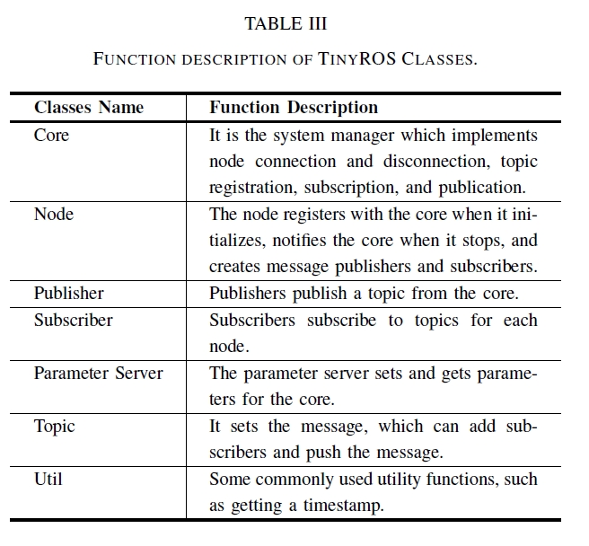
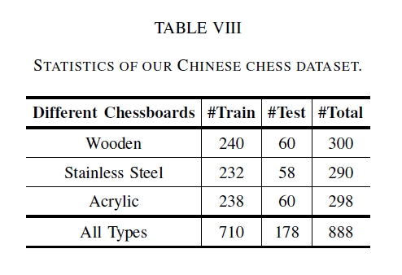

# chinese-chess-robot
An Open-Source Robotic Chinese Chess Player

**Authors:** Shan An, Guangfu Che, Jinghao Guo, Yanjie Xu, Guoxin Wang, Konstantinos A. Tsintotas, Fukai Zhang, Junjie Ye, Changhong Fu, Haogang Zhu, and Hong Zhang. The paper is submitted to IROS 2023.

## 0. Overview

Consumer robots can accompany children growing up, improving their abilities while playing and entertaining. This paper presents an open-source, practical, low-cost robotic Chinese chess player. The proposed system includes an
elaborate mechanical structure, a simple kinematic solution, a novel robot operating system, real-time and accurate chess recognition. Regarding its mechanical design, it combines a magnetism structure and mechanical cam drive, while the
overall system has just three servo motors. At the same time, its control strategy is simple and effective. Furthermore, a lightweight robot message communication mechanism, entitled TinyROS, is developed for computing resource-limited embedded
chips. Concerning the recognition process, our CNNbased object detector determines chess and achieves accurate identification. As a result, our robotic Chinese chess player is exquisite and easy for large-scale promotion while improving
users’ chess skills. Aiming to facilitate future consumer robot research and popularize customer robots, the model’s mechanical and software design and the TinyROS protocol are open-sourced at https://github.com/Star-Robot/chinese-chess-robot.

**The advantages:** 
+ TinyROS as a flexible and lightweight operating system.
+ High recognition accuracy is supported for different chessboards.
+ A ingenuity mechanical structure design allowing low price and practicality.

 

## 1. TinyROS

We propose TinyROS specifically for consumer robots. Our system is a lightweight, compact mechanism for robotic message communication that
follows two of the five philosophical goals of the original pipeline:

**The goal:** 
+ Thin: our version is tiny as it is written in C++ with 2112 total lines of code. 
+ Free and open-source: we adopt the BSD license, allowing users to employ it for development in non-commercial and commercial projects. 

 
 
 ## 2. Mechanical Design
 
 Todo
 
 ## 3. Chess Recognition
 
 Todo
 
 ## 4. Our Chess Dataset
Using different materials, we produced three chessboards, i.e., wood, stainless steel, and acrylic (see Fig. 4). Our dataset consists of 888 images taken by the camera mounted on the robotic arm. Next, the object detection box of chess pieces was manually labeled. Since there are 32 chess pieces in Chinese chess, 888 × 32 = 28, 416 object boxes were generated. 

 
 BaiduDrive：https://pan.baidu.com/s/10JhYSNpMmbTfBLIbXO0tBQ 
 Code：osko
 
 
